**Main window**

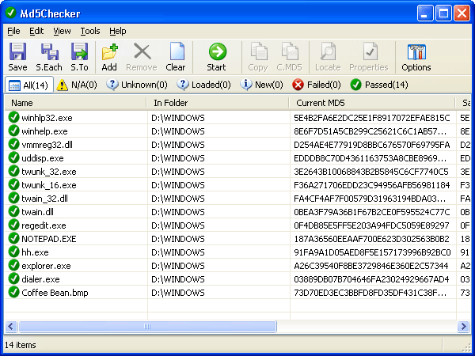

**Main window**

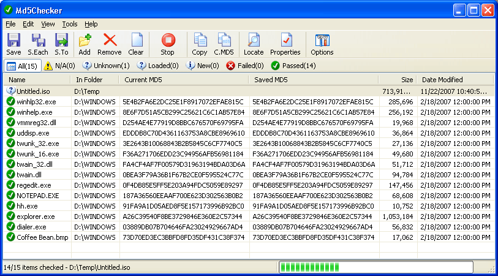

**Compare MD5 dialog - one file**

Only needed if there is no previously saved MD5 file.

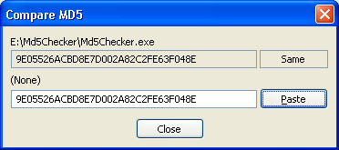

**Compare MD5 dialog - two files**

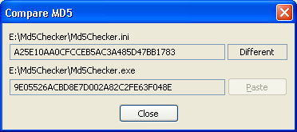

**MD5 Calculator dialog**

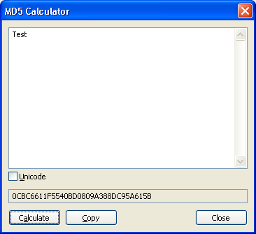

**Options dialog - Add tab**

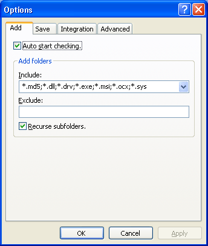

**Options dialog - Save tab**

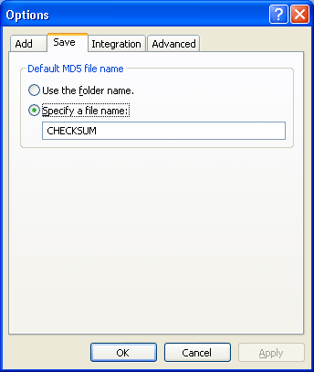

**Options dialog - Integration tab**

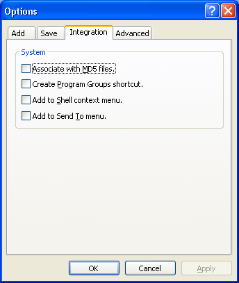

**Options dialog - Advanced tab**

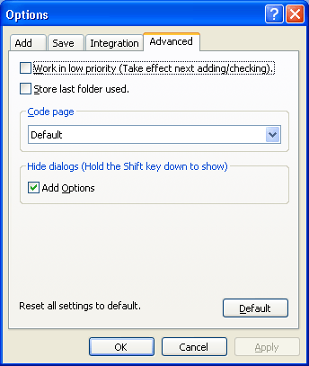

**Open File dialog (enhanced)**

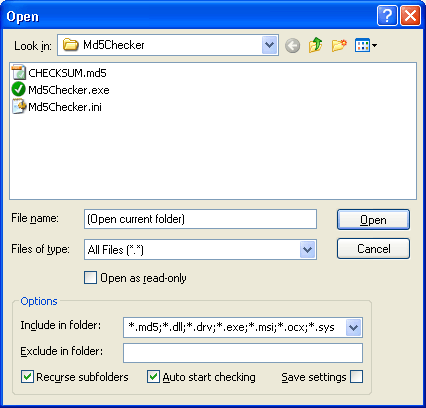

**Add Options dialog (for files and folders)**

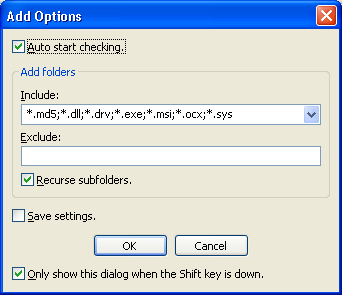

**Add Options dialog (for files only)**

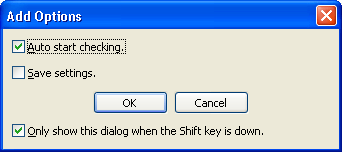

